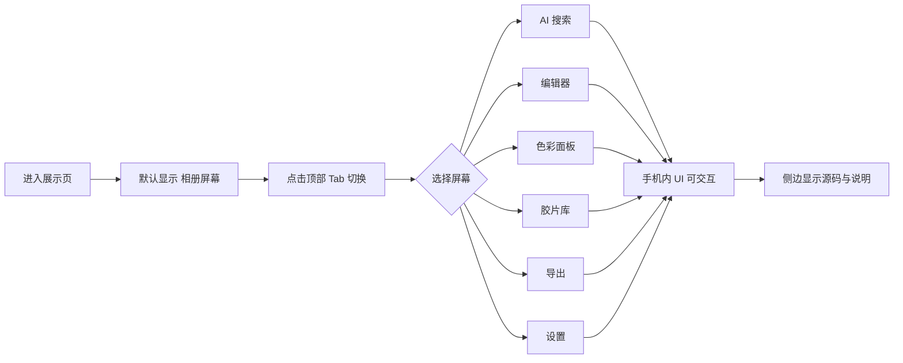

# PRD · Alcedo Studio Android 端界面 Web 展示

## 1. 产品概述

以**多手机 mockup 并列 + 可切换屏幕**的方式，在 Web 上 1:1 还原 Alcedo Studio Android 端的真实功能界面。用户可在浏览器中点击切换不同功能页（相册 / 编辑器 / 胶片库 / 导出 / AI 搜索），完整体验 Android 端的 UI 布局、交互逻辑与功能闭环。
- **目标**：让评估者无需安装 APK 即可全面审视 Android 端 UI 完成度
- **形式**：单页应用，顶部功能切换栏 + 中央手机 mockup + 侧边功能说明

## 2. 核心功能

### 2.1 功能模块（屏幕）

| # | 屏幕名称 | 对应 Android 文件 | 核心展示内容 |
|---|---------|------------------|-------------|
| 1 | **相册 / 图库** | `MainScreen.kt` + Sleeve | 顶部搜索栏、AI 标签筛选 chips、缩略图网格、评级星标、底部导航 |
| 2 | **AI 语义搜索** | `AiService.kt` | 搜索框、自然语言查询历史、语义匹配结果带相似度%、AI 自动标签 |
| 3 | **照片编辑器** | `EditorViewModel.kt` + `RenderService.kt` | 主预览区、底部工具栏（曝光/白平衡/色彩/HSL/几何）、右侧直方图、顶部撤销/重做/版本 |
| 4 | **色彩调整面板** | color_science + operators | ACES/OpenDRT 切换、色轮、HSL、通道混合器、曲线、阴影/高光分区 |
| 5 | **胶片模拟库** | `lut_op` + `film_grain_op` + `halation_op` | 6 款胶片预设卡片、Portra 400 等预览、颗粒/Halation 强度滑块 |
| 6 | **导出面板** | `ExportService.kt` + `ultra_hdr_writer` | 格式选择、色彩空间、ICC 配置、HDR 开关、批量队列、进度条 |
| 7 | **设置 / 关于** | `AlcedoApplication.kt` | 模型管理、GPU 后端（GLES/Vulkan）、镜头校准库、版本信息 |

### 2.2 交互方式

- 顶部 Tab 栏切换 7 个屏幕
- 中央手机 mockup（Android 状态栏 + 导航栏 + Alcedo 应用 UI）
- 左侧固定显示当前屏幕对应的功能说明 + 涉及的源码文件链接
- 右侧显示该屏幕用到的关键技术栈徽章
- 手机内 UI 元素可点击展开二级面板（如编辑器工具栏点击 → 弹出参数面板）

## 3. 核心流程

## 4. 用户界面设计

### 4.1 设计风格

**美学方向：技术档案 · 设备模拟风**

- **整体氛围**：模拟 IDE/设计稿审查工具的暗色界面，手机 mockup 居中突出
- **主色**：工作台深灰 `#16181d`（背景）+ 设备黑 `#0d0f12`（手机框）+ 屏幕暖白 `#f5f1ea`
- **强调色**：Alcedo 琥珀 `#d4823a`（主交互）+ 青蓝 `#4a90a4`（次级）
- **字体**：
  - UI/正文：`Inter` 替换为 `Manrope`（避开常见字体）
  - 等宽（路径/技术栈）：`JetBrains Mono`
  - 手机内大标题：`Fraunces`（杂志感衬线，仅用于屏幕内 hero 文字）
- **手机 mockup**：圆角 36px、刘海/挖孔、状态栏（时间/电量/信号）、底部导航栏
- **布局**：三栏 —— 左说明栏（280px）+ 中手机（390×844，iPhone 14 Pro 比例但显示 Android UI）+ 右技术栏（240px）
- **细节**：手机屏幕内还原 Material You 设计、Dynamic Color、底部 NavigationBar

### 4.2 页面设计概览

| 区域 | 模块 | UI 元素 |
|------|------|---------|
| 顶部 | Tab 切换栏 | 7 个 Tab 图标 + 名称，当前项琥珀色下划线 |
| 左栏 | 屏幕说明 | 屏幕标题 + 描述 + 涉及源码文件列表（可点击）|
| 左栏 | 功能点列表 | 该屏幕的 3-5 个核心功能项 + 复选标记 |
| 中央 | 手机 mockup | 设备外框 + 屏幕 + 状态栏 + 内容区 + 底部导航 |
| 中央 | 屏幕内容 | 根据当前 Tab 渲染对应 Android UI |
| 右栏 | 技术栈徽章 | 该屏幕涉及的 C++/Kotlin 模块、GPU 后端、数据层 |
| 右栏 | 性能指标 | 该功能的性能数据（如编辑器实时帧率、AI 检索延迟）|
| 底部 | 全局信息条 | 项目版本、开源协议、GitHub 链接 |

### 4.3 各屏幕 UI 细节

**屏幕 1 · 相册**
- 顶栏：搜索图标 + "Alcedo" 标题 + 更多菜单
- 第二行：横向滚动的 AI 标签 chips（"人像" "日落" "街拍" "风景"）
- 主区：3 列缩略图网格，每张图右下角星级（1-5 星）
- 底部 NavigationBar：图库 / 搜索 / 编辑 / 导出 / 我的

**屏幕 2 · AI 搜索**
- 顶部搜索框（含麦克风图标），placeholder "用自然语言描述照片…"
- 历史查询 chips："海边日落的人像" "秋季金黄的树叶" "夜间城市灯光"
- 结果区：2 列卡片，每卡含缩略图 + 相似度 92% + AI 标签
- 底部 "AI 正在分析 1,247 张照片" 进度提示

**屏幕 3 · 编辑器**
- 顶部：返回 + 文件名 + 撤销/重做 + 版本历史图标 + 导出
- 主预览区：占 65% 高度的照片
- 右上角浮窗：RGB 直方图 + 通道开关
- 底部工具栏：横向滚动 12 个工具图标（曝光/对比度/白平衡/HSL/色轮/曲线/几何/镜头校正/清晰度/锐化/颗粒/HDR）
- 点击工具 → 弹出参数面板（滑块组）

**屏幕 4 · 色彩面板**
- 顶部 Tab：ACES / OpenDRT 切换
- 色轮区：3 个色轮（阴影/中间调/高光），可拖动调整
- HSL 区：8 色相滑块
- 通道混合器：3×3 矩阵输入
- 曲线区：可拖动贝塞尔曲线

**屏幕 5 · 胶片库**
- 顶部 "经典胶片模拟" 标题
- 6 张胶片卡片纵向列表：每卡含缩略图（应用胶片 LUT 后）+ 胶片名 + ISO + 描述
- 选中后底部弹出参数：颗粒强度 / Halation 强度 / 褪色 / 暗角
- 卡片右上角 "应用于当前照片" 按钮

**屏幕 6 · 导出**
- 顶部 "导出设置"
- 格式选择：JPEG / PNG / TIFF / DNG / Ultra HDR
- 色彩空间：sRGB / P3 / Rec2020
- ICC 配置：下拉选择 11 个内置 ICC
- HDR 开关 + 嵌入 ICC 开关
- 尺寸 / 质量 / 命名模板
- 底部 "导出 1 张" 按钮 + 队列指示

**屏幕 7 · 设置**
- 分组列表：
  - AI 模型管理（Jina CLIP v2 / SigLIP 2 / MobileCLIP S2 三个开关）
  - GPU 后端（GLES Compute / Vulkan 单选）
  - 镜头校准库（60+ XML 已加载）
  - ICC 配置文件（11 个已内置）
  - 隐私与安全
  - 关于 Alcedo Studio v1.0

### 4.4 响应式

- 桌面（≥ 1200px）：三栏完整布局
- 平板（768–1199px）：隐藏右栏，左栏折叠为抽屉
- 移动端（< 768px）：仅显示手机 mockup + 顶部 Tab，左栏改为底部展开按钮

### 4.5 3D / 视差

不使用。保持平面设备模拟，专注 UI 还原准确度。
