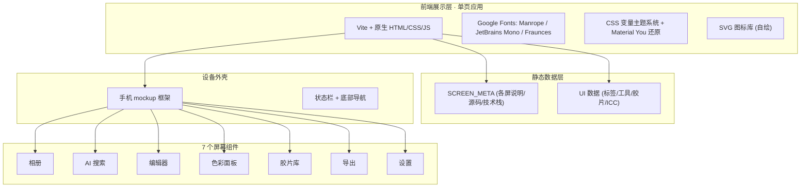
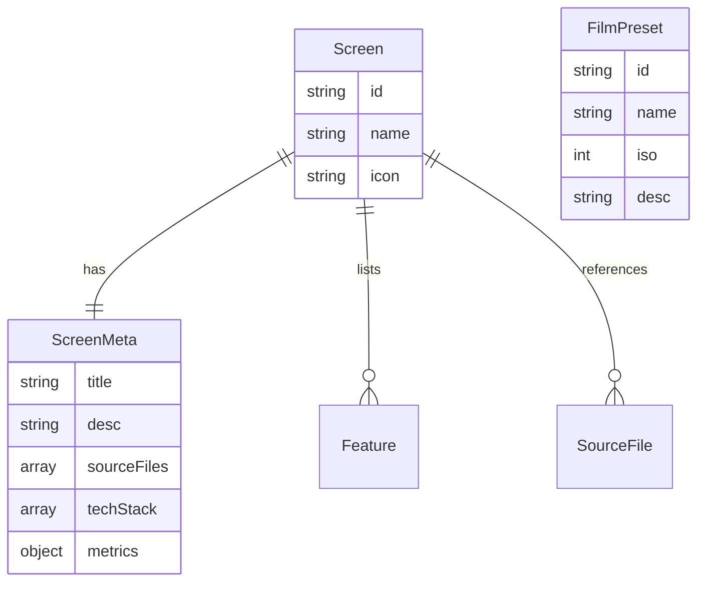

# 技术架构 · Alcedo Studio Android 端界面 Web 展示

## 1. 架构设计



## 2. 技术说明

- **前端**：原生 HTML5 + CSS3 + 原生 JavaScript（ES2020+），零框架零依赖，专注精确 UI 还原
- **构建工具**：Vite 5（dev server + 静态打包）
- **字体**：Google Fonts CDN：`Manrope`（UI）、`JetBrains Mono`（路径/代码）、`Fraunces`（手机内 hero 衬线）
- **图标**：全部自绘 SVG（Material Symbols 风格 + 自定义摄影图标）
- **后端 / 数据库**：无，所有数据内联 JS 常量
- **响应式**：CSS Grid + clamp()，桌面优先

## 3. 路由定义

| 路由 | 用途 |
|------|------|
| `/` | 单页应用，通过 Tab 切换 7 个屏幕 |

锚点状态通过 JS 管理 `data-screen` 属性，无 URL 路由（保持简单）。

## 4. API 定义

无后端 API。数据结构示例：

```javascript
const SCREENS = [
  {
    id: 'gallery',
    name: '相册',
    icon: 'grid',
    title: '智能图库',
    desc: '基于 Sleeve 资产管理 + AI 语义标签的极速图库',
    sourceFiles: ['MainScreen.kt', 'sleeve_manager.cpp', 'SleeveFilterService.kt'],
    features: ['AI 自动标签筛选', '语义搜索', '星级评级', '海量 RAW 浏览'],
    techStack: ['Sleeve C++', 'Room + SQLCipher', 'metadata-extractor'],
    metrics: { loadMs: 80, supportFormats: '60+ RAW' }
  },
  // ...其余 6 屏
];
```

## 5. 服务端架构

不适用（纯静态页面）。

## 6. 数据模型

### 6.1 数据模型定义



### 6.2 数据定义语言

不使用 SQL。所有数据以内联 JS 常量维护：

- `SCREENS`：7 个屏幕元数据
- `AI_LABELS`：相册 / AI 搜索屏的标签
- `EDITOR_TOOLS`：编辑器底部 12 个工具
- `COLOR_WHEELS`：3 个色轮配置
- `FILM_PRESETS`：6 款胶片预设
- `EXPORT_FORMATS`：导出格式与色彩空间
- `ICC_PROFILES`：11 个内置 ICC 文件名
- `AI_MODELS`：3 个 AI 模型配置

## 7. 关键实现

### 7.1 屏幕切换机制
- 顶部 Tab 点击 → `switchScreen(id)` → 更新 `data-screen` 属性
- CSS `[data-screen="gallery"] .screen-gallery { display: block }` 控制显隐
- 切换时手机内 UI 重置到初始状态

### 7.2 手机 mockup 框架
- 外框：`border-radius: 36px` + `box-shadow` 多层 + 边框 8px 黑色
- 屏幕：内嵌 `<div class="screen">`，390×844px（Android 主流尺寸）
- 状态栏：固定顶部，含时间/信号/电量 SVG
- 底部导航：固定底部，5 个图标 + 文字

### 7.3 编辑器工具栏交互
- 横向滚动 `.tools-strip` 含 12 个 SVG 图标
- 点击工具 → 底部弹出 `.tool-panel` 显示对应滑块组
- 滑块拖动 → 实时更新预览区滤镜（CSS `filter` 模拟）

### 7.4 胶片库对比
- 每张胶片卡片含前后对比：`clip-path` 控制上层可见区域
- 拖动滑块更新 `--pos` 变量

### 7.5 色轮实现
- SVG `<circle>` + `radial-gradient` 绘制色轮
- 中心可拖动手柄（`pointermove` 更新 `--x` `--y`）

### 7.6 三栏联动
- 屏幕切换时，左栏（说明 + 源码）与右栏（技术栈 + 指标）同步更新
- 通过 `SCREENS` 数组查找当前屏幕元数据填充

## 8. 性能与可访问性

- **字体**：`font-display: swap`
- **图片**：所有缩略图用 CSS 渐变 + SVG 模拟，零外部资源
- **动画**：transform/opacity 优先，60fps
- **a11y**：Tab 键可切换屏幕，对比度 WCAG AA，`aria-label` 标注图标按钮
- **prefers-reduced-motion**：禁用过渡动画
